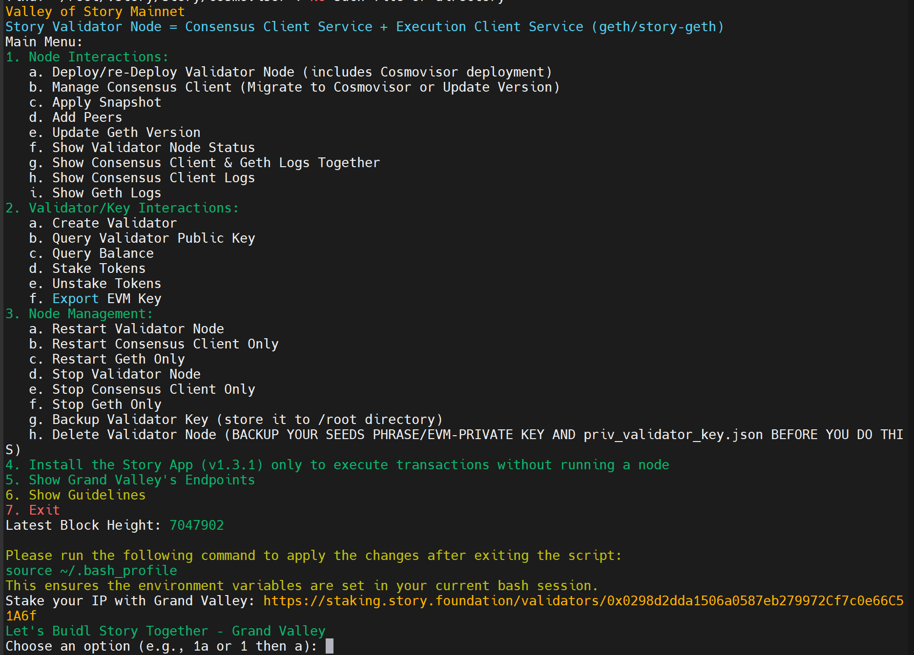

<p align="center">
  
</p>

<h1 align="center">Valley of Story Mainnet</h1>

<p align="center">
  <strong>A comprehensive toolkit for deploying and managing Story Protocol validator nodes on mainnet</strong>
</p>

<p align="center">
  <a href="https://www.story.foundation" target="_blank">Story Protocol</a> •
  <a href="https://docs.story.foundation" target="_blank">Official Docs</a> •
  <a href="https://github.com/hubofvalley" target="_blank">Grand Valley</a>
</p>

---

## 🚀 Overview

Valley of Story Mainnet is an open-source project by **Grand Valley** that provides automated scripts for deploying and managing Story Protocol validator nodes on mainnet.

## 📋 System Requirements

| Category | Requirements |
|----------|--------------|
| CPU | 8+ cores |
| RAM | 32+ GB |
| Storage | 500+ GB NVMe SSD |
| Bandwidth | 100+ MBit/s |

## ⚡ Quick Start

Run the main interactive menu:

```bash
bash <(curl -s https://raw.githubusercontent.com/hubofvalley/Valley-of-Story-Mainnet/main/resources/valleyofStory.sh)
```

## 📦 Features

The Valley of Story menu provides:

### Node Interactions
- Deploy/re-deploy validator node (with Cosmovisor)
- Manage consensus client (migrate to Cosmovisor or update version)
- Apply snapshots
- Add peers
- Update Geth version
- Show node status and logs

### Validator/Key Interactions
- Create validator
- Query validator public key
- Query balance
- Stake/unstake tokens
- Export EVM key

### Node Management
- Start/stop/restart services
- Backup validator key
- Schedule stop/restart operations
- Delete validator node

## 🔧 Current Versions

| Component | Version |
|-----------|---------|
| Story (consensus) | v1.4.2 |
| Story-Geth (execution) | v1.2.0 |
| Chain | story |
| Chain ID | 1514 |

## 🌐 Grand Valley Public Endpoints

| Type | URL |
|------|-----|
| Cosmos RPC | `https://lightnode-rpc-mainnet-story.grandvalleys.com` |
| EVM RPC | `https://lightnode-json-rpc-mainnet-story.grandvalleys.com` |
| Cosmos REST API | `https://lightnode-api-mainnet-story.grandvalleys.com` |
| Cosmos WebSocket | `wss://lightnode-rpc-mainnet-story.grandvalleys.com/websocket` |
| EVM WebSocket | `wss://lightnode-wss-mainnet-story.grandvalleys.com` |
| Peer | `fffb1a0dc2b6af331c65328c1ed9afad0bf107de@peer-mainnet-story.grandvalleys.com:37656` |
| Seed | `68205aae335cffa1e1995f59a6fc8832e434d98a@seed-mainnet-story.grandvalleys.com:36656` |

## 🔐 Privacy & Security

- **No external data storage** - All operations run locally
- **No phishing links** - All URLs are for legitimate Story operations
- **Open source** - Full audit trail available
- Please verify script integrity before running

## 📖 Documentation

For detailed documentation, see the [docs/](docs/) folder.

## 🔗 Links

**Story Protocol:**
- [Website](https://www.story.foundation) | [Docs](https://docs.story.foundation) | [X/Twitter](https://x.com/StoryProtocol)

**Grand Valley:**
- [GitHub](https://github.com/hubofvalley) | [X/Twitter](https://x.com/bacvalley) | [Mainnet Guide](https://github.com/hubofvalley/Mainnet-Guides/tree/main/Story)

**Validators & Explorers:**
- [Story Staking](https://staking.story.foundation/validators/0x0298d2dda1506a0587eb279972Cf7c0e66C51A6f)
- [StoryScan](https://storyscan.app/validators/storyvaloper1q2vd9hdp2p4qtplty7vh9nmupenv2xn0turd4p)
- [Story Guru Explorer](https://story.explorers.guru/validator/storyvaloper1q2vd9hdp2p4qtplty7vh9nmupenv2xn0turd4p)

## 📧 Contact

Email: letsbuidltogether@grandvalleys.com

## 📄 License

This project is licensed under the MIT License - see the [LICENSE](LICENSE) file for details.
